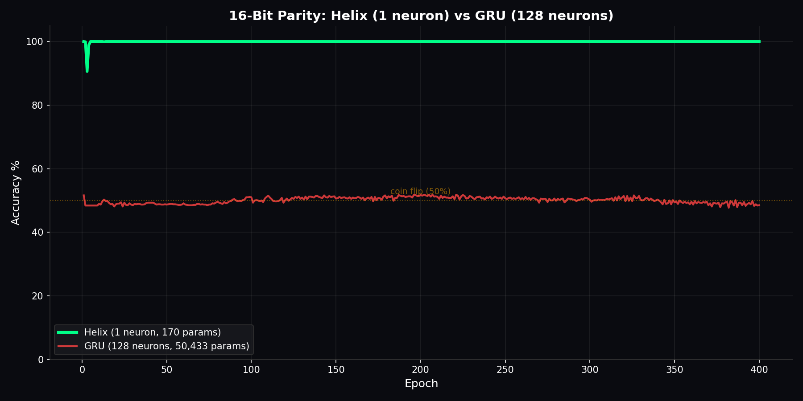

# Helix

**Phase-rotation sequence memory architecture.**

Solves lossless discrete recall tasks that standard RNNs cannot solve at any scale, using orders of magnitude fewer parameters.

## The problem with standard RNNs

Every RNN, LSTM, GRU, and most transformer variants store memory as floating point numbers multiplied by weight matrices each timestep. Multiply `1.0` by `0.95` a hundred times and you get `0.006`. The information is gone. This is why GRU cannot learn 16-bit parity: the contractive update rule destroys the early bits before the network sees the later ones. More parameters do not fix this. It is a structural property of the update rule, not a capacity problem.

## What Helix does differently

Helix stores memory as phase angles that accumulate over time instead of decaying.

**Phase accumulation**: each neuron maintains a phase angle that shifts forward with each new input via `phi += sigmoid(gate) * pi`. Angles do not decay. A neuron that has seen 10,000 steps carries a different phase from one that has seen 10 steps, and both are recoverable.

**Quantization sieve**: after each update the phase is softly snapped to a `pi/4` grid. This forces neurons into eight discrete stable states instead of drifting through continuous space, giving the cell structural stability on discrete inputs.

**Multi-harmonic readout**: instead of reading the raw angle, Helix extracts features at multiple frequencies: `cos(phi)`, `sin(phi)`, `cos(2*phi)`, `sin(2*phi)`, `cos(4*phi)`, `sin(4*phi)`, `cos(8*phi)`, `sin(8*phi)`. One angle produces a rich eight-dimensional feature.

**Winding number**: with `full_state=True`, the phase is not wrapped modulo `2*pi`. A neuron that has rotated 47 times carries different information from one that rotated 3 times, even if both currently point at the same angle.

**Binary alignment**: a special mode where `phi = 0.5*phi + bit*pi`. This maps a bit stream into the phase via recursive half-shifts. Decoding reverses this with Bernoulli unwinding. For discrete bit inputs this gives exact encode/decode with no information loss.

## Benchmarks

### 16-bit parity

1 Helix neuron (16 parameters) vs 128 GRU neurons (50,562 parameters). Task: compute XOR of 16 input bits. Requires remembering every bit without any error.



Helix hits 100% by epoch 100 and stays there. GRU oscillates near 50% (coin flip) for all 400 epochs. GRU cannot learn this task in standard training because its contractive update destroys early bits before the network sees the later ones. Helix solves it with one neuron because phase accumulation does not lose anything on discrete inputs.

### Crystalline loop: bit-perfect ASCII encode/decode

Encodes 8-bit ASCII characters into Helix phase angles using binary alignment mode, then decodes them back.


Helix achieves 100% bit-level accuracy. GRU stays near 50% because it cannot maintain the precision required for lossless encoding.

### 8-bit majority vote

8 Helix neurons (409 parameters) vs 128 GRU neurons (50,433 parameters).


Both solve it. Helix uses 123x fewer parameters because counting does not require contractive memory.

### Bracket matching

32 Helix neurons (5.4K parameters) vs 128 GRU neurons (50K parameters).


Helix 92.2%, GRU 94.2%, at 10x fewer parameters. Essentially tied.

### Sine wave tracking

Helix (32 hidden, 5K parameters) vs GRU (256 hidden, 199K parameters).


GRU wins on raw MSE because sine prediction is a continuous curve-fitting problem and GRU has 36x more parameters for fitting. Helix is not the right tool for continuous approximation tasks.

### Summary

| benchmark | helix | gru | helix params | gru params |
|-----------|-------|-----|-------------|-----------|
| 16-bit parity | **100%** | ~50% | 169 | 50,433 |
| crystalline loop | **100%** | ~0% | small | small |
| 8-bit majority vote | **100%** | 100% | 409 | 50,433 |
| bracket matching | 92.2% | 94.2% | 5,377 | 50,433 |
| sine wave MSE | higher | **lower** | 5,473 | 199,169 |

Helix wins decisively on lossless discrete recall. GRU wins on continuous approximation. The claim is narrow and specific: for tasks requiring exact recall of discrete sequential structure, Helix achieves it with orders of magnitude fewer parameters and a structural guarantee that the update rule cannot provide.

## Crystal suite

Built on top of the core cell: a full memory system for production use.

| module | what it does |
|--------|-------------|
| `crystal/substrate.py` | `MemoryCrystal`: portable `.hx` binary format, absorb/recall/export/load |
| `crystal/temporal_index.py` | `TemporalPhaseIndex`: random access to any past timestep, phase cosine search |
| `crystal/affective.py` | `AffectiveEncoder`: emotional state in dedicated low-frequency phase bands |
| `crystal/resonance.py` | `ResonanceDetector`: detect when absorbed sequences settle into stable patterns |
| `crystal/multimodal.py` | `MultiModalFusion`: text (768d) + image (512d) + audio (384d) into one crystal |
| `crystal/synthesis.py` | `PhaseDecoder`, `PhasicRelay`: decode phase state back to embedding space |
| `crystal/phicrypt.py` | `PhiCrypt`: key-derived phase rotation encryption, `.hxe` file format |
| `crystal/phase_collapse.py` | `PhaseCollapseRegister`: permanent irreversible binary flags |
| `crystal/spectrum_cache.py` | `SpectrumCache`: incremental harmonic recomputation, only updates changed neurons |
| `crystal/distillation.py` | `ContextDistiller`: compression stats for long-sequence absorption |
| `crystal/phase_diff.py` | `PhaseDiff`, `PhaseVersionTracker`: git-style diff and rollback for memory states |
| `crystal/memory.py` | `HelixMemory`: unified orchestrator for the full suite |

### HelixMemory: one entry point for everything

Run from inside the `helix/` directory, or add it to your `sys.path` first.

```python
from crystal.memory import HelixMemory

mem = HelixMemory(hidden_size=64, passphrase="secret")

# absorb any combination of modalities
mem.absorb(text=text_embedding, valence=0.8, arousal=0.3)
mem.absorb(image=clip_embedding)
mem.absorb(audio=whisper_embedding, valence=-0.2, arousal=0.7)

# recall
features = mem.recall()          # (512,) harmonic feature vector
affect   = mem.affect_state()    # {'valence': 0.4, 'arousal': 0.5, 'label': 'alert'}
velocity = mem.phase_velocity()  # how fast the memory is changing

# versioning
mem.commit("after onboarding")
mem.commit("after first support call")
changeset = mem.diff()           # what changed between versions
print(changeset.summary())

# permanent flags
mem.register_flag("churned", idx=0)
mem.set_flag("churned")          # irreversible
mem.get_flag("churned")          # True

# save: writes encrypted .hxe if passphrase was set
path = mem.save("user_123")

# load on next session
mem2 = HelixMemory(hidden_size=64, passphrase="secret")
mem2.load("user_123.hxe")
past_phi = mem2.recall_at(step=5)         # jump to step 5
similar  = mem2.search(query_phi, top_k=3) # find similar past moments
```

## Advanced training features

`advanced_features.py` contains three training protocols.

**CryostasisManager**: when a neuron's error drops below `2^-9`, it permanently zeros its gradient. The neuron is done learning and cannot be overwritten. Prevents catastrophic forgetting.

**DynamicBrakingLoss**: scales the loss gradient based on phase correlation. Fast exploration early, smooth stabilization at convergence.

**MnemonicShieldLR**: context-aware learning rate that protects established memories during continued training.

## Usage

```python
# Training cell (preferred)
from helix import HelixNeuronModel

model = HelixNeuronModel(
    input_size=8,
    hidden_size=32,
    output_size=2,
    harmonics=[1, 2, 4, 8],
)
output, confidence = model(input_sequence)

# Substrate-compatible cell (used by crystal suite)
from helix import HelixModel
```

## Run the benchmarks

```bash
pip install torch numpy matplotlib seaborn

python benchmarks/parity.py
python benchmarks/sine_wave.py
python benchmarks/crystalline_loop.py
python benchmarks/majority_vote.py
python benchmarks/bracket_matching.py
python benchmarks/sandwich_duel.py
python benchmarks/color_algebra.py
```

## Files

| file | what it does |
|------|-------------|
| `helix.py` | `HelixCell`, `HelixNeuronCell`, `HelixModel`, `HelixNeuronModel`: full architecture |
| `advanced_features.py` | `CryostasisManager`, `DynamicBrakingLoss`, `MnemonicShieldLR` |
| `config.py` | per-task hyperparameter configs |
| `benchmarks/` | reproducible benchmark scripts |
| `results/` | benchmark proof charts |
| `crystal/` | full memory system built on top of the core cell |

## Requirements

```
torch>=2.0
numpy
matplotlib
```

## Author

Pavan Kalyan ([@Cintu07](https://github.com/Cintu07))
